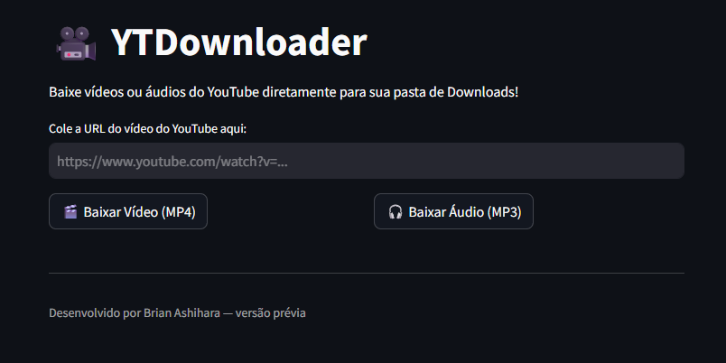

# 🎥 YTDownloader

> Um aplicativo web simples e elegante para baixar vídeos e áudios do YouTube diretamente para a pasta **Downloads** do seu computador.

---

## 🚀 Sobre o Projeto

O **YTDownloader** é uma aplicação desenvolvida em **Python** utilizando o **Streamlit** e a poderosa biblioteca **yt-dlp**.  
Ele permite baixar vídeos ou extrair apenas o áudio de links do YouTube, de forma rápida, gratuita e sem complicações.

Este projeto foi criado como um **MVP (Minimum Viable Product)** — ou seja, uma primeira versão funcional e mínima, voltada a demonstrar a ideia principal de maneira eficiente e organizada.  

---

---

---

## 🧩 Funcionalidades

✅ Download de vídeos em alta qualidade (até 1080p)  
🎧 Download apenas do áudio em `.mp3`  
💾 Salvamento automático na **pasta de Downloads do usuário**  
⚡ Mensagens dinâmicas de status (“Preparando download...”, “Download concluído!”)  
💬 Interface amigável e interativa via navegador  
🧱 Código limpo, modular e pronto para evolução  

---

## 🛠️ Tecnologias e Técnicas Utilizadas

| Categoria | Tecnologia / Técnica | Descrição |
|------------|----------------------|------------|
| **Framework Web** | 🌐 [Streamlit](https://streamlit.io/) | Interface interativa em navegador |
| **Download Engine** | 📦 [yt-dlp](https://github.com/yt-dlp/yt-dlp) | Ferramenta para baixar e converter vídeos |
| **Conversão de Mídia** | 🎞️ FFmpeg (via yt-dlp) | Processamento de áudio e vídeo |
| **Arquitetura** | 🧱 Padrão MVP | Produto mínimo viável, funcional e demonstrável |
| **UX/UI** | 💡 Uso de placeholders (`st.empty()`) | Atualização em tempo real de mensagens |
| **Sistema de Arquivos** | 🗂️ `pathlib` e `os` | Identificação automática da pasta Downloads |
| **Boas Práticas** | ✅ Código limpo e organizado | Facilidade de leitura e manutenção |

